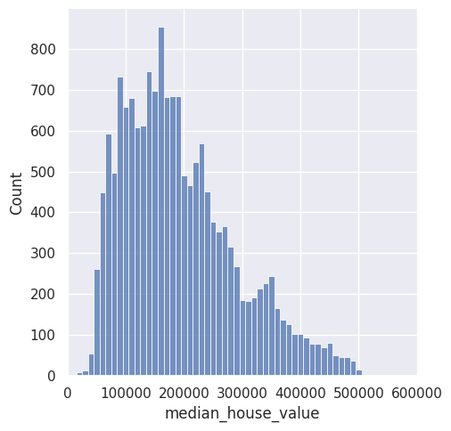
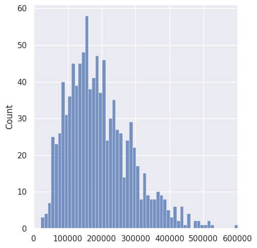

<script type="text/x-mathjax-config">
    MathJax.Hub.Config({
        tex2jax: {
        skipTags: ['script', 'noscript', 'style', 'textarea', 'pre'],
        inlineMath: [['$','$']]
        }
    });
    </script>
      
<script type="text/javascript" async src="https://cdn.mathjax.org/mathjax/latest/MathJax.js?config=TeX-MML-AM_CHTML"> </script>

***

# Maximum Likelihood Estimation

**A powerfull parametric method**

*Posted on August 2023*

***

There are many ways to estimate parameters of a statistical model. One of which is maximum likelihood estimation. This method led to a powerful estimation not only for a normally distributed process but also other kinds of distribution. It estimates parameters by the use of likelihood function. What is the likelihood function?

## Likelihood Estimation

The process that we are trying to model can be described by

$$p(y|\theta{}) = Y$$

This model read as: given a parameter $\theta{}$, the probability that this process result in $Y$ is $p(y|\theta{})$. But we do not know the real parameters. We have our uncertainty about our guesses of the true parameters. So we estimate the parameter by looking at the data or observing the joint pdf $p(y|\theta{})$. Or in another word, we make $y$ fixed for a certain range

$$L(\theta{}|y)$$

This is what is called likelihood function. It tells us the likelihood of parameter theta given the data that we observed. And its value is the same as the joint pdf $p(y|\theta{})$ for all available $\theta{}$.

It is a distribution because it is a random variable. But we can select theta that has the highest likelihood of producing the data by finding the highest peak of this distribution. This is what is called maximum likelihood estimation.

## Maximum Likelihood Estimation

If the likelihood function is continuous and differentiable, then we can use calculus to find $\theta{}$ that has the highest likelihood. But in practice, numerical methods are used by our computer to iteratively try different sets of theta. Below is an example of the use of maximum likelihood estimation to model California house value in python


```python
import pandas as pd
from scipy.stats import gamma
import seaborn as sns
import matplotlib.pyplot as plt
```


```python
df = pd.read_csv("/content/sample_data/california_housing_train.csv")
df.head()
```


  <div id="df-d6720a3a-3cda-4777-a5ad-733b366c9955" class="colab-df-container">
    <div>
<style scoped>
    .dataframe tbody tr th:only-of-type {
        vertical-align: middle;
    }

    .dataframe tbody tr th {
        vertical-align: top;
    }

    .dataframe thead th {
        text-align: right;
    }
</style>
<table border="1" class="dataframe">
  <thead>
    <tr style="text-align: right;">
      <th></th>
      <th>longitude</th>
      <th>latitude</th>
      <th>housing_median_age</th>
      <th>total_rooms</th>
      <th>total_bedrooms</th>
      <th>population</th>
      <th>households</th>
      <th>median_income</th>
      <th>median_house_value</th>
    </tr>
  </thead>
  <tbody>
    <tr>
      <th>0</th>
      <td>-114.31</td>
      <td>34.19</td>
      <td>15.0</td>
      <td>5612.0</td>
      <td>1283.0</td>
      <td>1015.0</td>
      <td>472.0</td>
      <td>1.4936</td>
      <td>66900.0</td>
    </tr>
    <tr>
      <th>1</th>
      <td>-114.47</td>
      <td>34.40</td>
      <td>19.0</td>
      <td>7650.0</td>
      <td>1901.0</td>
      <td>1129.0</td>
      <td>463.0</td>
      <td>1.8200</td>
      <td>80100.0</td>
    </tr>
    <tr>
      <th>2</th>
      <td>-114.56</td>
      <td>33.69</td>
      <td>17.0</td>
      <td>720.0</td>
      <td>174.0</td>
      <td>333.0</td>
      <td>117.0</td>
      <td>1.6509</td>
      <td>85700.0</td>
    </tr>
    <tr>
      <th>3</th>
      <td>-114.57</td>
      <td>33.64</td>
      <td>14.0</td>
      <td>1501.0</td>
      <td>337.0</td>
      <td>515.0</td>
      <td>226.0</td>
      <td>3.1917</td>
      <td>73400.0</td>
    </tr>
    <tr>
      <th>4</th>
      <td>-114.57</td>
      <td>33.57</td>
      <td>20.0</td>
      <td>1454.0</td>
      <td>326.0</td>
      <td>624.0</td>
      <td>262.0</td>
      <td>1.9250</td>
      <td>65500.0</td>
    </tr>
  </tbody>
</table>
</div>
    <div class="colab-df-buttons">

  <div class="colab-df-container">
    <button class="colab-df-convert" onclick="convertToInteractive('df-d6720a3a-3cda-4777-a5ad-733b366c9955')"
            title="Convert this dataframe to an interactive table."
            style="display:none;">

  <svg xmlns="http://www.w3.org/2000/svg" height="24px" viewBox="0 -960 960 960">
    <path d="M120-120v-720h720v720H120Zm60-500h600v-160H180v160Zm220 220h160v-160H400v160Zm0 220h160v-160H400v160ZM180-400h160v-160H180v160Zm440 0h160v-160H620v160ZM180-180h160v-160H180v160Zm440 0h160v-160H620v160Z"/>
  </svg>
    </button>

  <style>
    .colab-df-container {
      display:flex;
      gap: 12px;
    }

    .colab-df-convert {
      background-color: #E8F0FE;
      border: none;
      border-radius: 50%;
      cursor: pointer;
      display: none;
      fill: #1967D2;
      height: 32px;
      padding: 0 0 0 0;
      width: 32px;
    }

    .colab-df-convert:hover {
      background-color: #E2EBFA;
      box-shadow: 0px 1px 2px rgba(60, 64, 67, 0.3), 0px 1px 3px 1px rgba(60, 64, 67, 0.15);
      fill: #174EA6;
    }

    .colab-df-buttons div {
      margin-bottom: 4px;
    }

    [theme=dark] .colab-df-convert {
      background-color: #3B4455;
      fill: #D2E3FC;
    }

    [theme=dark] .colab-df-convert:hover {
      background-color: #434B5C;
      box-shadow: 0px 1px 3px 1px rgba(0, 0, 0, 0.15);
      filter: drop-shadow(0px 1px 2px rgba(0, 0, 0, 0.3));
      fill: #FFFFFF;
    }
  </style>

    <script>
      const buttonEl =
        document.querySelector('#df-d6720a3a-3cda-4777-a5ad-733b366c9955 button.colab-df-convert');
      buttonEl.style.display =
        google.colab.kernel.accessAllowed ? 'block' : 'none';

      async function convertToInteractive(key) {
        const element = document.querySelector('#df-d6720a3a-3cda-4777-a5ad-733b366c9955');
        const dataTable =
          await google.colab.kernel.invokeFunction('convertToInteractive',
                                                    [key], {});
        if (!dataTable) return;

        const docLinkHtml = 'Like what you see? Visit the ' +
          '<a target="_blank" href=https://colab.research.google.com/notebooks/data_table.ipynb>data table notebook</a>'
          + ' to learn more about interactive tables.';
        element.innerHTML = '';
        dataTable['output_type'] = 'display_data';
        await google.colab.output.renderOutput(dataTable, element);
        const docLink = document.createElement('div');
        docLink.innerHTML = docLinkHtml;
        element.appendChild(docLink);
      }
    </script>
  </div>


<div id="df-484fca9d-c916-49b8-82ad-77b3718272c3">
  <button class="colab-df-quickchart" onclick="quickchart('df-484fca9d-c916-49b8-82ad-77b3718272c3')"
            title="Suggest charts."
            style="display:none;">

<svg xmlns="http://www.w3.org/2000/svg" height="24px"viewBox="0 0 24 24"
     width="24px">
    <g>
        <path d="M19 3H5c-1.1 0-2 .9-2 2v14c0 1.1.9 2 2 2h14c1.1 0 2-.9 2-2V5c0-1.1-.9-2-2-2zM9 17H7v-7h2v7zm4 0h-2V7h2v10zm4 0h-2v-4h2v4z"/>
    </g>
</svg>
  </button>

<style>
  .colab-df-quickchart {
      --bg-color: #E8F0FE;
      --fill-color: #1967D2;
      --hover-bg-color: #E2EBFA;
      --hover-fill-color: #174EA6;
      --disabled-fill-color: #AAA;
      --disabled-bg-color: #DDD;
  }

  [theme=dark] .colab-df-quickchart {
      --bg-color: #3B4455;
      --fill-color: #D2E3FC;
      --hover-bg-color: #434B5C;
      --hover-fill-color: #FFFFFF;
      --disabled-bg-color: #3B4455;
      --disabled-fill-color: #666;
  }

  .colab-df-quickchart {
    background-color: var(--bg-color);
    border: none;
    border-radius: 50%;
    cursor: pointer;
    display: none;
    fill: var(--fill-color);
    height: 32px;
    padding: 0;
    width: 32px;
  }

  .colab-df-quickchart:hover {
    background-color: var(--hover-bg-color);
    box-shadow: 0 1px 2px rgba(60, 64, 67, 0.3), 0 1px 3px 1px rgba(60, 64, 67, 0.15);
    fill: var(--button-hover-fill-color);
  }

  .colab-df-quickchart-complete:disabled,
  .colab-df-quickchart-complete:disabled:hover {
    background-color: var(--disabled-bg-color);
    fill: var(--disabled-fill-color);
    box-shadow: none;
  }

  .colab-df-spinner {
    border: 2px solid var(--fill-color);
    border-color: transparent;
    border-bottom-color: var(--fill-color);
    animation:
      spin 1s steps(1) infinite;
  }

  @keyframes spin {
    0% {
      border-color: transparent;
      border-bottom-color: var(--fill-color);
      border-left-color: var(--fill-color);
    }
    20% {
      border-color: transparent;
      border-left-color: var(--fill-color);
      border-top-color: var(--fill-color);
    }
    30% {
      border-color: transparent;
      border-left-color: var(--fill-color);
      border-top-color: var(--fill-color);
      border-right-color: var(--fill-color);
    }
    40% {
      border-color: transparent;
      border-right-color: var(--fill-color);
      border-top-color: var(--fill-color);
    }
    60% {
      border-color: transparent;
      border-right-color: var(--fill-color);
    }
    80% {
      border-color: transparent;
      border-right-color: var(--fill-color);
      border-bottom-color: var(--fill-color);
    }
    90% {
      border-color: transparent;
      border-bottom-color: var(--fill-color);
    }
  }
</style>

  <script>
    async function quickchart(key) {
      const quickchartButtonEl =
        document.querySelector('#' + key + ' button');
      quickchartButtonEl.disabled = true;  // To prevent multiple clicks.
      quickchartButtonEl.classList.add('colab-df-spinner');
      try {
        const charts = await google.colab.kernel.invokeFunction(
            'suggestCharts', [key], {});
      } catch (error) {
        console.error('Error during call to suggestCharts:', error);
      }
      quickchartButtonEl.classList.remove('colab-df-spinner');
      quickchartButtonEl.classList.add('colab-df-quickchart-complete');
    }
    (() => {
      let quickchartButtonEl =
        document.querySelector('#df-484fca9d-c916-49b8-82ad-77b3718272c3 button');
      quickchartButtonEl.style.display =
        google.colab.kernel.accessAllowed ? 'block' : 'none';
    })();
  </script>
</div>
    </div>
  </div>


Let's use histogram to plot the median house value so we have an idea about the distribution of the data.


```python
sns.set(rc={'figure.figsize':(12,8)})
sns.displot(data=df, x="median_house_value", binwidth=10000)
plt.xlim(0, 600000)
plt.show()
```


    

    


We see that this process, California house value might not have a normally distributed distribution. Further, this notebook will use gamma function to model this process.

Also, we see that there are outliers with house value above 500000. Before we go further we need to remove this outliers so that our articial model best expressed the process. We will just use a simple outliers remove which remove all value above 500000.


```python
df = df[df["median_house_value"] < 500000]
```

After we removed the outliers, the histogram now looks like this.


```python
sns.set(rc={'figure.figsize':(12,8)})
sns.displot(data=df, x="median_house_value", binwidth=10000)
plt.xlim(0, 600000)
plt.show()
```


    

    


Scipy already has numbers of amazing function that we can use to many distributions. To do maximum likelihood estimation in scipy, we can just call fit on the function that we assumed the distribution of the process.


```python
a, loc, scale = gamma.fit(df["median_house_value"])
print("a: {}".format(a))
print("Location: {}".format(loc))
print("Scale: {}".format(scale))
```

    a: 3.280774292048559
    Location: 13028.695548223923
    Scale: 54601.07627116213
    

This is the gamma distribution parameters that the maximum likelihood estimation think that best expressed our data. Now how about we try to simulate new data based on this distribution?


```python
data_from_artificial_model = gamma.rvs(a=a, loc=loc, scale=scale, size=1000, random_state=123)
sns.set(rc={'figure.figsize':(12,8)})
sns.displot(data=data_from_artificial_model, binwidth=10000)
plt.xlim(0, 600000)
plt.show()
```


    

    


We can see, visually, that our articial model has more or less produce the same data as the real process.

And we want to estimate the range where 90% of the data fall we get


```python
low_ci, high_ci = gamma.interval(confidence=0.90, a=a, loc=loc, scale=scale)
print(f"Lower bound confidence interval: {low_ci}, Upper bound confidenec interval: {high_ci}")
```

    Lower bound confidence interval: 65706.8610206829, Upper bound confidenec interval: 379539.5286284525
    

## Why Maximum Likelihood Estimation?

Now the question is why do we even use maximum likelihood estimation as opposed to the plug-in estimate? First of all, this method can model the uncertainty of our estimate. Through the use of the likelihood functions we indirectly model our parameter within a certain range of value. The second reason is that this method is not only able to model normally distributed processes, but also other processes that have weird distributions. For example a logistic function. We can see how much logistic function is being used in modern statistics and machine learning.
